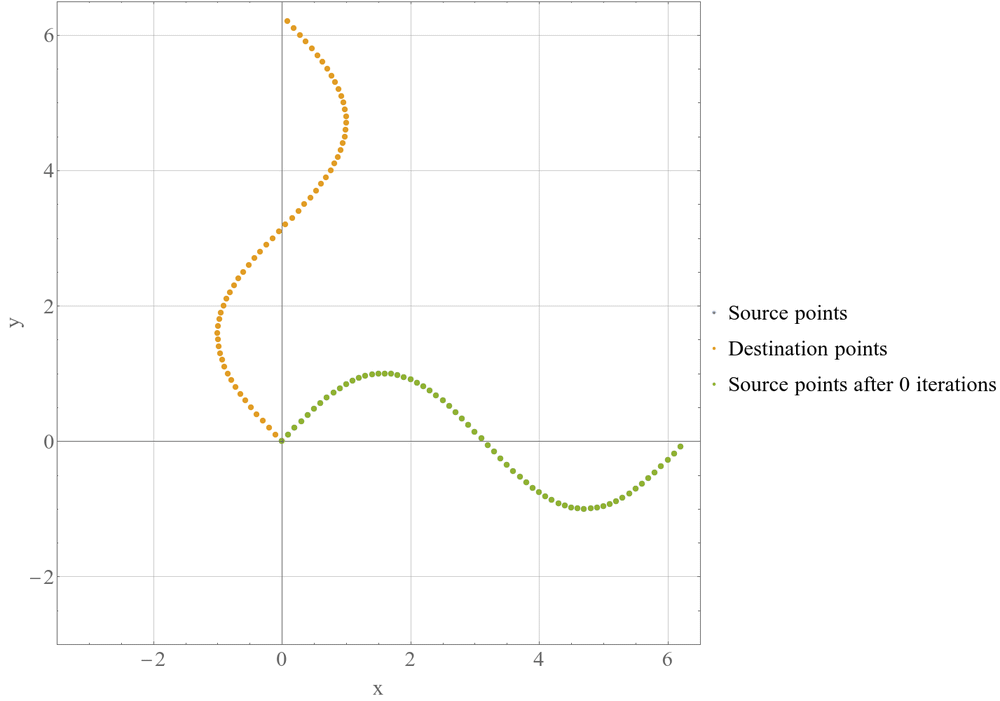

# Iterative Closest Point Algorithm

## What is in this repository?
In this repository, I present my implementation to the Iterative Closest Point (ICP) algorithm in both Python and Wolfram Mathematica. Soon, I'll be adding my implementation of ICP in C++.

## Example:
In this example, I utilize the developed ICP algorithm to align two sinusoidal point clouds that are originally identical, i.e., of identical shapes, but have been subjected to a homogeneous transformation.

The animation presented below visually demonstrates how the ICP algorithm progressively brings the two point clouds into alignment, achieving a high degree of overlap between them.

## Code Details
Here is the step by step explanation of each of the functions developed to implement the iterative closest point algorithm.

### best_fit_transformation

This function implements a least-squares best-fit transformation algorithm that maps corresponding points from two datasets, A and B. It calculates the translation vector, rotation matrix, and homogeneous transformation matrix required to transform A onto B.

Steps:
- Check that A and B have same shape.
- Calculate the centroids of A and B and translates the points to their centroids.
- Calculate the rotation matrix using singular value decomposition (SVD). If the determinant of the rotation matrix is negative, reflect the last row of Vt.
- Calculate translation using the transformed centroids and the rotation matrix. 
- Construct homogeneous transformation matrix using the rotation matrix and translation vector.
- Return transformation matrix, rotation matrix, and translation vector.

### nearest_neighbor

The function takes two input datasets src and dst and returns the euclidean distances and indices of the nearest neighbors in dst for each point in src.

Steps:
- Check that src and dst have same shape.
- Create a nearest neighbor search tree using dst dataset. Use the search tree to find the corresponding points of src in dst.
- Return distances and indices of the correspondances.

### iterative_closest_point

The iterative closest point algorithm finds the best-fit transformation that maps the points in A onto the points in B. The algorithm proceeds iteratively by estimating a transformation between A and B, applying it to A, and then estimating a new transformation between the updated A and B. The iterations continue until the difference between the mean error of the closest point distances between the current and previous iterations is less than a tolerance value or until the maximum number of iterations is reached.

The input to the function includes two arrays, A and B, containing the source and destination points, respectively, as well as the number of maximum iterations to be performed. The output is the final homogeneous transformation matrix T that maps A onto B, the updated A dataset, the overall euclidean distance (error) of the nearest neighbor, and the number of iterations performed to reach convergence.

Steps:
- Repeat until convergence:
	- Use nearest_neighbor function to find the points in B that correspond to the points in A.
	- Use best_fit_transform function to solve for the homogeneous transformation that maps the points in A to their correspondance points in B.
	- Update A using the homogeneous transformation
- Return final transformation, updated A, overall error, performed iterations
